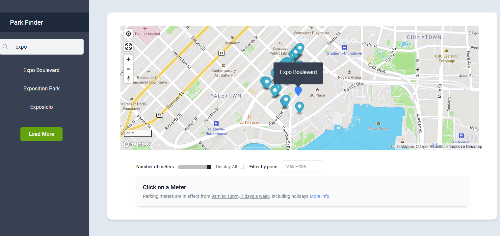
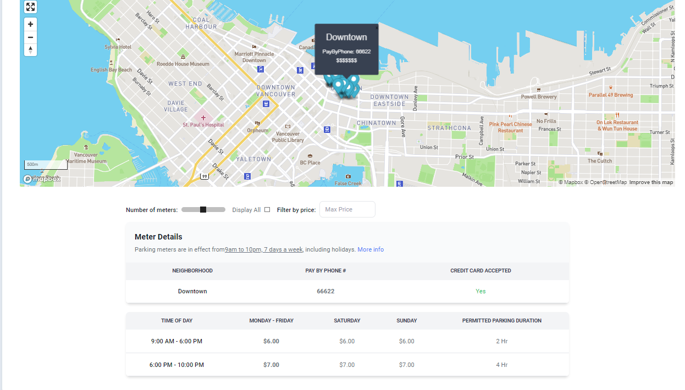
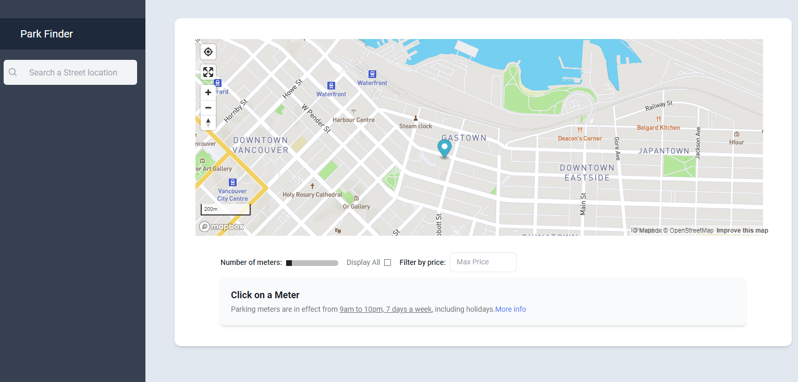
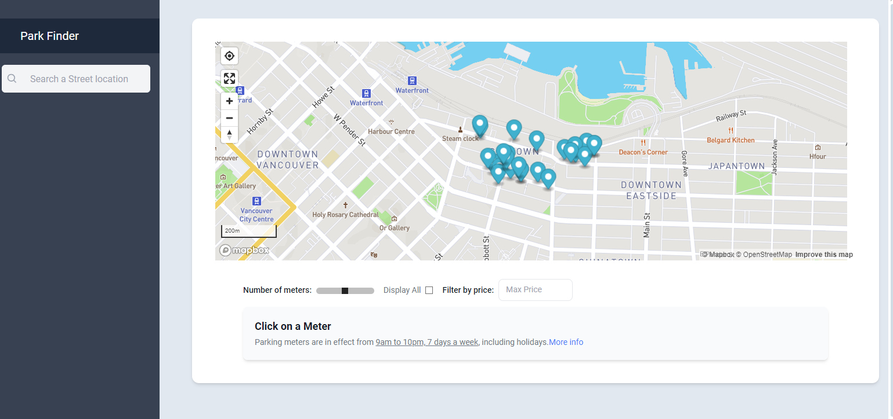
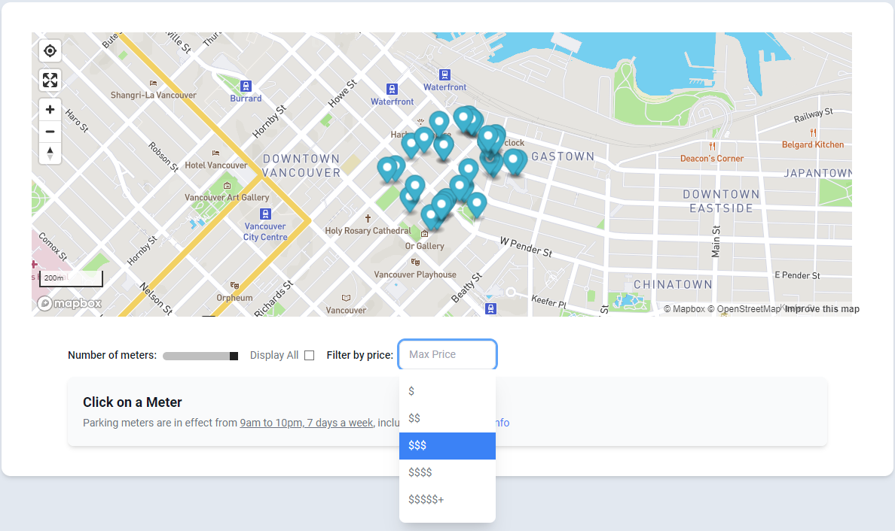

# Park App

This parking app helps you locate a parking spot in Vancouver.
It uses the MapBox API and Vancouver OpenData API to get the user's location parking spots in the area.
It gives the user's location, Pay By Phone code number, parking price, and permitted duration. 
It also allows users to search for parking spots by address or intersection.

## Features
- Get user's location and nearby parking spots
- Search for parking spots by address or intersection
- Get parking spot details (Pay By Phone code number, parking price, hours of operation and permitted duration)
- Display parking spot on the map
- Filter parking spots by price and duration
- Link to PaybyPhone pay portal with the code copied


## Installation

Copy the code from the repository. 
Head to [MapBox](https://docs.mapbox.com/mapbox-gl-js/plugins/) to get a token for the map API,
Then, head to [Vancouver OpenData API](https://vancouver.opendatasoft.com/explore/dataset/parking-meters/api/) to get another token for the parking meters.
Put the keys in ApiKey.jsx

```
npm I
npm start
```

## Usage
- Open the app in your browser

- Click on the "Get My Location" button to get your current location and nearby parking spots

- Click on a parking spot to get its details

- Click on the PopUp to link to the PaybyPhone pay portal with the code

- Click on the Search bar to search for parking spots by address or intersection

- Use the Slider to show increase/decrease how much parking spots are in the area


- Set a price range for the parking


## Technologies Used

- MapBox
- Vancouver OpenData API
- JavaScript, HTML, CSS
- React
- React-map--gl
- Tailwind CSS

## Future Improvements
- Add more features to the app, such as filtering by parking type (e.g. street, parking lot, etc.) or by accessibility features (e.g. wheelchair accessible, etc.)
- Improve the user interface and user experience
- Add more data sources for parking spots, such as private parking lots or garages
- Add a feature to save favorite parking spots
- Add a feature to get directions to the parking spot


## Dev Logs
- https://docs.google.com/document/d/1C3VBn-tKxmFSg6b2PAU216bwgmaKQ_kaYybp_yEGWSw/edit?usp=sharing


